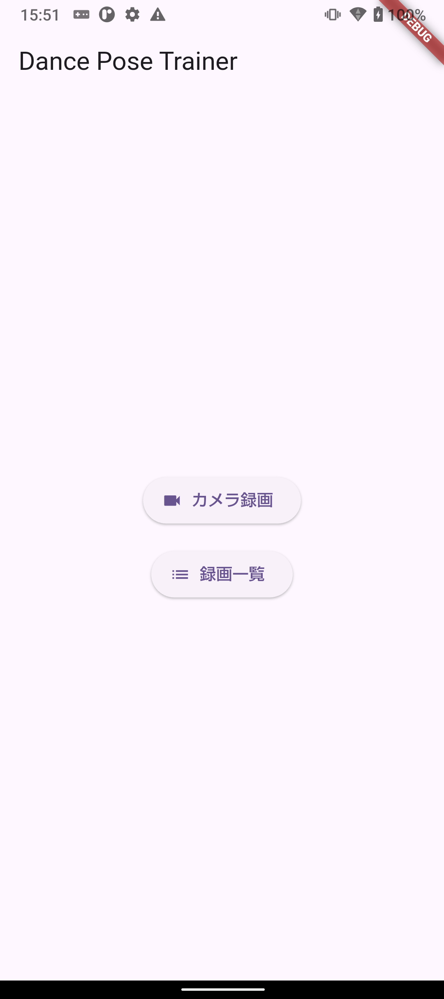
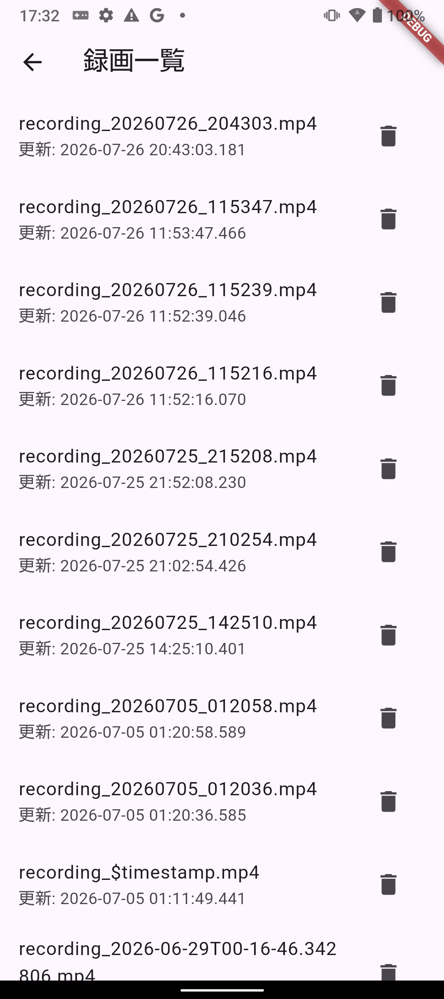

# Dance Pose Trainer

Flutterで開発中の、ダンス練習を支援するモバイルアプリです。

スマートフォンでダンスを録画し、保存した動画を再生しながら、姿勢解析の結果を関節点と骨格線として動画上に表示することを目指しています。

## 主な機能

現在、以下の機能を実装しています。

* カメラを使用した動画撮影
* 録画ファイルのアプリ専用領域への保存
* 保存した録画ファイルの一覧表示
* 録画動画の再生
* 動画再生中の定期的なフレーム解析
* 姿勢解析結果の関節点・骨格線によるオーバーレイ表示
* 姿勢表示を確認するためのモック画面

## 画面イメージ




## 画面構成

* Home：各機能へのメニュー
* Camera：動画の撮影と保存
* Recordings：保存した録画ファイルの一覧
* Video Player：動画再生と姿勢解析結果の表示
* Pose Preview：姿勢表示の確認

## 姿勢解析の流れ

動画の再生状態を監視し、再生中のみ一定間隔で解析処理を実行します。

1. 保存した動画を再生
2. 再生位置を取得
3. 対象位置の動画フレームを解析処理へ渡す
4. 検出した関節位置を取得
5. `CustomPaint`を使用して関節点と骨格線を動画上に描画

解析処理が重複しないように制御し、一時停止中や動画終了後には解析を停止する構成にしています。

## 使用技術

* Flutter
* Dart
* Camera
* Video Player
* CustomPaint
* Android実機での動作確認
* Pose Detectionライブラリの組み込み検証

## 現在の開発状況

録画、保存、録画一覧、動画再生、定期的な解析処理、骨格のオーバーレイ表示まで実装しています。

姿勢推定部分については、MediaPipeやML Kitなどの利用を検証しています。現在は依存ライブラリの整合性、姿勢推定の精度、フレーム解析の処理速度を調整中です。

このリポジトリは開発中のポートフォリオです。

## 今後の予定

* 姿勢推定ライブラリの構成調整
* 姿勢推定の精度改善
* フレーム解析間隔の最適化
* ダンス動作の比較機能
* 姿勢や動作に対するフィードバック表示
* UIとエラー処理の改善
* テストの追加

## Androidでの実行手順

### 前提条件

* Flutter SDKがインストールされていること
* Android SDKがインストールされていること
* Android実機またはエミュレータが用意されていること

### 1. 依存パッケージを取得

```bash
flutter pub get
```

### 2. 接続中のデバイスを確認

```bash
flutter devices
```

### 3. アプリを起動

```bash
flutter run -d <device-id>
```

注意点:
- 初回起動時にカメラとマイクの権限を求められます。許可してください。
- 録画ファイルはアプリのドキュメントフォルダ（アプリ専用領域）に保存されます。

今後の拡張:
- 録画ファイルからPose Detection（MediaPipeやML Kit）を組み込みやすい構成にしています。

